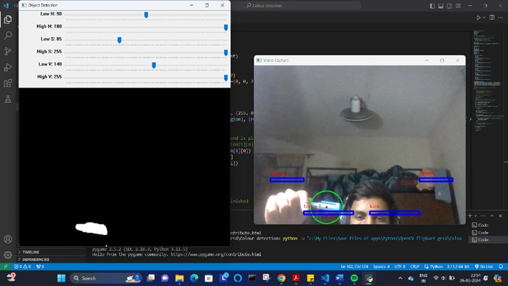

# Virtual-Drum
This project is virtual drum set for anyone having just a webcam and a computer! Using computer vision, it detects your drum stick and maps its location on the screen to different drum sounds. Strike specific regions on the screen with the stick to play corresponding sounds like kick, snare, hi-hat, creating a realistic drumming experience. 

The project utilizes Python libraries OpenCV and Pygame. It captures video frames, identifies the red stick, calculates its center of mass, and plays the associated sound if it falls within a designated region. It can be customized to play a variety of sounds and jam onto any music.

## Instructions to run the project

Make sure you have following python dependencies installed (if not then install using pip install command):

1. For the colour_detection_drum file:

   - cv2
   - pygame

> Note: Use a blue-coloured pen(or some blue object) for the sticks. Make sure that colour is not present anywhere in the background. 
You can also adjust the low_V value using the slider if you want to use some other coloured object as the stick.

2. For the hand_drum file:

   - mediapipe
   - cv2
   - pygame

Made by Tashadur Rahman.
